# Local Video Generator Design

Date: 2026-06-15

## Goal

Build a local desktop tool for generating videos from company canvas resources.

The first version focuses on one useful closed loop:

1. User opens the local app.
2. User logs in to the company canvas website with their own account.
3. The app saves the local browser login state.
4. User enters a canvas URL, such as `http://qijing.kjjhz.cn/canvas/cmq6fwhft0bg5m2l5u78zby8x`.
5. The app reads the canvas resources through the same API calls used by the company website.
6. User selects resources and basic output settings.
7. The app generates a local video file.

This project does not need a server for the first version. All login state, API discovery data, cached resources, and generated videos stay on the user's computer.

## Non-Goals For Version 1

- Rebuilding the company canvas editor.
- Fixing the company canvas performance directly.
- Building a cloud rendering service.
- Supporting team collaboration.
- Creating a complete one-click publishing workflow.
- Supporting every possible canvas element type before the API shape is understood.
- Bypassing authorization or accessing data outside the logged-in user's normal permissions.

## Recommended Technology Stack

Use Electron, React, TypeScript, Playwright, and FFmpeg.

### Desktop App

- Electron for the local desktop shell.
- React and TypeScript for the user interface.
- Vite for development and bundling.
- electron-builder for packaging.

### Company Website Automation

- Playwright for opening the company website, letting the user log in, saving browser storage state, and replaying authenticated requests.
- Playwright network listeners for discovering the APIs used by the canvas page.
- A local storage-state file for cookies and localStorage.

### Local Data

- Start with JSON files for version 1.
- Store data under a local app data directory:
  - `storage/auth/state.json`
  - `storage/api/canvas-api-map.json`
  - `storage/assets`
  - `storage/outputs`
- Move to SQLite later if history, search, queues, or many projects become important.

### Video Generation

- FFmpeg for the first renderer.
- The app creates a simple timeline manifest, then calls FFmpeg locally.
- Version 1 can support image sequences, static image duration, simple audio, and basic transitions only after resources are confirmed.

## Why This Stack

Electron and Playwright share the Node ecosystem, which makes login state, browser automation, file downloads, uploads, and local FFmpeg calls straightforward. Tauri would produce a smaller app, but it adds Rust and makes the Playwright-centered workflow less direct. A pure local web app would be fast to prototype, but login automation, native file handling, and packaging would become weaker.

## System Modules

### 1. App Shell

Responsible for app startup, window management, menu actions, safe IPC boundaries, and local file paths.

### 2. Login Session Manager

Responsible for:

- Opening the company login page in a controlled browser window.
- Waiting for the user to complete login.
- Saving Playwright storage state locally.
- Testing whether the session is still valid.
- Clearing login state when requested.

### 3. Canvas API Inspector

Responsible for:

- Opening the provided canvas URL while logged in.
- Listening to network requests and responses.
- Identifying likely canvas detail, resource list, upload, and file download APIs.
- Saving a readable API map for review.

The first pass should capture evidence before hard-coding API calls. This avoids guessing the private API shape.

### 4. Canvas Resource Client

Responsible for:

- Loading saved login state.
- Calling the discovered canvas APIs.
- Normalizing the returned resources into a stable local shape.
- Downloading resource files into the local cache.
- Reporting missing auth, expired sessions, and unsupported resource types clearly.

### 5. Upload Client

Responsible for uploading local resources through the same authenticated APIs the company site uses.

Version 1 should discover and document upload APIs, but upload can be implemented after resource fetching and local video generation are stable.

### 6. Timeline Builder

Responsible for turning selected resources into a simple timeline manifest.

Version 1 timeline shape:

```json
{
  "canvasUrl": "http://qijing.kjjhz.cn/canvas/cmq6fwhft0bg5m2l5u78zby8x",
  "width": 1920,
  "height": 1080,
  "fps": 30,
  "clips": [
    {
      "assetId": "asset-1",
      "type": "image",
      "durationSeconds": 3
    }
  ]
}
```

### 7. Video Renderer

Responsible for:

- Validating that source files exist.
- Generating FFmpeg command arguments from the timeline.
- Running FFmpeg locally.
- Reporting progress and errors.
- Writing the final video to `storage/outputs`.

## Data Flow

```mermaid
flowchart LR
  A["User logs in"] --> B["Save Playwright storage state"]
  B --> C["User enters canvas URL"]
  C --> D["Open canvas page with saved login"]
  D --> E["Capture network APIs"]
  E --> F["Fetch canvas resources"]
  F --> G["Cache assets locally"]
  G --> H["Build simple timeline"]
  H --> I["Render video with FFmpeg"]
  I --> J["Write local output video"]
```



## First Version User Flow

1. User clicks "Login".
2. App opens the company site.
3. User logs in manually.
4. App confirms session validity.
5. User pastes a canvas URL.
6. App opens the canvas in the background or controlled browser.
7. App captures relevant API calls and saves an API map.
8. App fetches resources for the canvas.
9. User selects supported resources.
10. User clicks "Generate".
11. App creates a local MP4.

## Authentication And Security

- The app must not ask the user for account password directly.
- The user logs in through the real company page.
- The app stores only browser login state on the local computer.
- Auth files should not be committed to GitHub.
- `.gitignore` must exclude local storage, generated outputs, logs, cookies, and captured private API payloads.
- If the session expires, the app asks the user to log in again.

## API Discovery Policy

Before implementing fixed API clients, run the complete flow once:

1. Login.
2. Open target canvas URL.
3. Capture network requests.
4. Identify resource-fetching APIs.
5. Identify upload APIs.
6. Save a sanitized API map.
7. Use the API map to implement typed request clients.

The committed documentation may describe endpoint categories, request methods, and required fields, but must not commit private tokens, cookies, or sensitive payloads.

## Error Handling

Important states to handle in version 1:

- Not logged in.
- Login expired.
- Canvas URL invalid.
- Canvas access denied.
- API discovery failed.
- No supported resources found.
- Resource download failed.
- FFmpeg missing.
- FFmpeg render failed.

Each state should show a clear action: log in again, retry, inspect captured API data, install FFmpeg, or choose different resources.

## GitHub Workflow

Every small feature must be committed and pushed to GitHub after verification.

Expected sequence:

1. Write or update a design document.
2. Wait for user confirmation.
3. Implement one small feature.
4. Run verification.
5. Commit with a focused message.
6. Push to `origin/main`.
7. Verify the remote branch points to the pushed commit.

## Suggested Milestones

### Milestone 1: Project Skeleton

- Add Electron, React, TypeScript, and Vite.
- Add basic app window.
- Add `.gitignore` for local storage and generated outputs.
- Verify the app starts locally.

### Milestone 2: Login Session

- Add Playwright login window or controlled login flow.
- Save storage state locally.
- Add session validity check.

### Milestone 3: Canvas API Capture

- Accept canvas URL input.
- Open URL with saved login state.
- Capture network requests and responses.
- Save sanitized API map locally.

### Milestone 4: Resource Fetching

- Implement typed client from discovered API map.
- List canvas resources in the UI.
- Download selected resources locally.

### Milestone 5: Basic Video Generation

- Build a simple timeline from selected resources.
- Render an MP4 with FFmpeg.
- Show output file path.

### Milestone 6: Upload API

- Discover upload flow.
- Upload a local resource through authenticated API.
- Confirm the uploaded resource appears in the canvas or resource list.

## Open Questions

1. Should version 1 generate a video from all canvas resources automatically, or should the user manually select resources?
2. Should the first renderer preserve canvas layout, or is a simple sequential slideshow acceptable for the first version?
3. Should the app support only the provided company domain first, or allow configurable domains later?

## Recommended First Implementation Step

Start with Milestone 1: the desktop app skeleton. This gives a stable local app foundation before touching login or private APIs.

After Milestone 1 is committed, move to Milestone 2 and run the real login flow.
